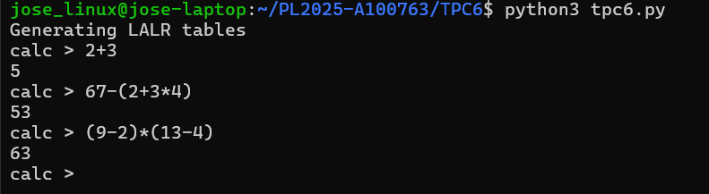

# TPC5

Data: 21/03/2025 <br>
Nome: José Pedro Torres Vasconcelos <br>
Número Mecanográfico: A100763 <br> <br> <br>


<br>

## **Resumo**
Programa escrito em python, baseado nos materiais fornecidos nas aulas, que cria um parser LL(1) recursivo descendente que reconheça expressões aritméticas e calcula o respetivo valor.

```
Exemplos de algumas frases:

2+3
67-(2+3*4)
(9-2)*(13-4)
``` 

## Exemplos de utilização

